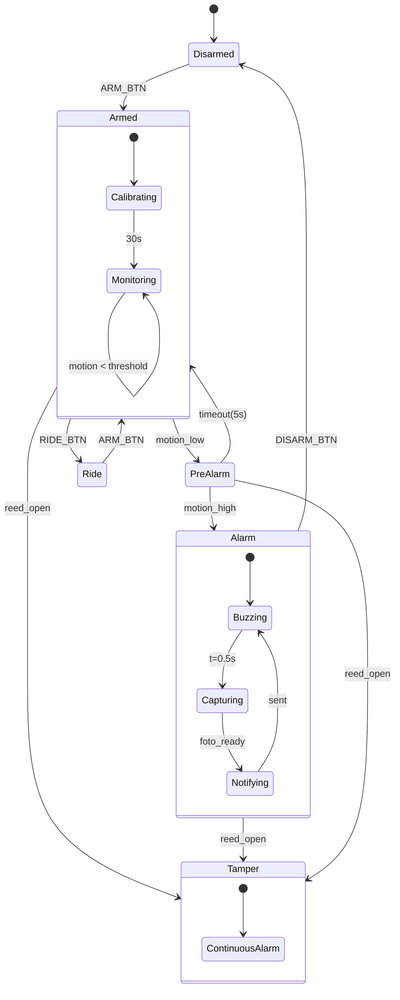
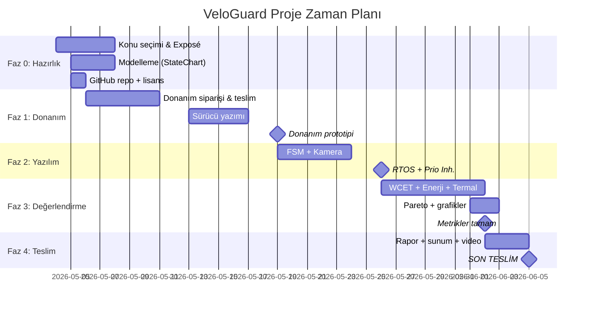

# 🛡️ VeloGuard — Akıllı Çok-Araçlı Hırsızlık Önleme Sistemi
## INF 208 Gömülü Sistemler — Proje Başlangıç Dokümanı

**Proje Kodu:** VeloGuard  
**Platform:** Raspberry Pi 3B (Linux + PREEMPT-RT)  
**Hedef Araçlar:** Bisiklet (MVP) → Scooter & Motosiklet (yazılım profili)  
**Ekip:** 3 Kişi  
**Teslim:** 05.06.2026 — 14:45, C208  
**Doküman Tarihi:** 09.05.2026 — v2 (Envanter güncellendi)

---

## 📋 İçindekiler

1. [Yönetici Özeti](#1-yönetici-özeti)
2. [Hocanın İsterleri ↔ Projenin Karşılığı (Uyum Matrisi)](#2-hocanın-isterleri--projenin-karşılığı)
3. [Sistem Mimarisi (Donanım + Yazılım)](#3-sistem-mimarisi)
4. [Bileşen Listesi (BOM) ve Maliyet](#4-bileşen-listesi-bom)
5. [Mekanik Tasarım ve Montaj](#5-mekanik-tasarım)
6. [Sistem Durumları ve Senaryolar (FSM)](#6-sistem-durumları-ve-senaryolar)
7. [RTOS ve Priority Inheritance](#7-rtos-tasarımı)
8. [Modelleme: StateChart + Petri Ağı](#8-modelleme)
9. [Değerlendirme Metrikleri (WCET, Enerji, Termal, Pareto)](#9-değerlendirme-metrikleri)
10. [3 Kişilik Görev Dağılımı](#10-görev-dağılımı)
11. [Zaman Planı (Gantt)](#11-zaman-planı)
12. [Test Senaryoları](#12-test-senaryoları)
13. [Teslimatlar Kontrol Listesi](#13-teslimatlar)
14. [Risk Yönetimi ve B Planı](#14-risk-yönetimi)

---

## 1. Yönetici Özeti

**VeloGuard**, Raspberry Pi tabanlı, IMU + kamera + manyetik sensör füzyonu kullanan, Linux PREEMPT-RT üzerinde gerçek-zamanlı task'lar ile çalışan bir **çok-araçlı hırsızlık önleme cihazıdır**. Sistem;

- Bisiklete monte edildiğinde **gizli ve enerji-optimize** çalışır,
- **5 durumlu sonlu durum makinesi** ile yanlış alarmı azaltır,
- Hareket algılandığında **kamera ile fotoğraf çekip** telefona BLE/Wi-Fi üzerinden gönderir,
- Yazılım profili değiştirilerek **scooter ve motosiklette de** çalışacak şekilde tasarlanır,
- Sürekli **priority inheritance protokolü** kullanan mutex'lerle priority inversion problemini çözer.

Sistem hocanın 110+5+5 = **120 puanlık tüm kriterlerini** karşılayacak şekilde tasarlanmıştır.

---

## 2. Hocanın İsterleri ↔ Projenin Karşılığı

### Zorunlu Kriterler (yoksa -50 puan)

| Hocanın İsteri | VeloGuard'da Karşılığı | Puan |
|---|---|---|
| ≥ 2 sensör entegrasyonu | MPU6050 (IMU) + Pi Camera + Reed switch + DHT22 → **4 sensör** | ✅ |
| ≥ 1 aktüatör | PAM8403+Hoparlör + LED + (opsiyonel) servo → **3 aktüatör** | ✅ |
| Mantıksal karar algoritması (FSM) | 5-state FSM: Disarmed → Armed → Pre-Alarm → Alarm → Ride | ✅ |
| ≥ 2 modelleme yöntemi | StateChart (durumlar) + Petri Ağı (kaynak çekişmesi) + UPPAAL Zamanlı Otomat (alarm gecikme) | ✅ |
| RTOS + Priority Inversion çözümü | Linux + PREEMPT-RT, `pthread_mutexattr_setprotocol(PTHREAD_PRIO_INHERIT)` | ✅ |
| ≥ 3 kantitatif değerlendirme | WCET (GPIO toggle) + Enerji (INA219) + Termal (DHT22+CPU) + Pareto (enerji↔gecikme) | ✅ |

### Puantaj Karşılığı (toplam 110 + 10 bonus)

| Kriter | Puan | Karşılığı |
|---|---|---|
| Sensör/Aktüatör + veri füzyonu | 40 | IMU+Kamera+Reed füzyonu, Kalman filtre, hata yönetimi |
| Algoritma | 10 | FSM + Kalman + adaptif eşik öğrenme |
| Performans | 10 | CPU<%70, RAM<%80, sıcaklık<80°C — sistemd-cgtop ile ölç |
| Yapı/Dokümantasyon | 15 | Modüler Python paketi, README, Git, doxygen-stil yorumlar |
| Hata Yönetimi | 10 | try/except, signal handler, IMU interrupt, watchdog |
| Özgün katkı | 10 | Çok-araçlı profil sistemi + adaptif öğrenme |
| Ölçeklenebilirlik | 5 | MQTT broker (Mosquitto), BOM analizi |
| Planlama | 10 | Gantt + iş bölümü tablosu raporda |
| Sunum | 10 | 5dk video + canlı demo + 12 slayt |
| **Bonus 1: GitHub açık kaynak** | +5 | MIT lisans, README, CONTRIBUTING.md |
| **Bonus 2: Kamera + görüntü işleme** | +5 | OpenCV motion detection + opsiyonel YOLO-nano |
| **TOPLAM HEDEF** | **120** | |


---

## 3. Sistem Mimarisi

### 3.1 Donanım Blok Diyagramı (metinsel)

```
                            ┌──────────────────────────────────┐
                            │       Raspberry Pi 3B       │
                            │   Linux + PREEMPT-RT yaması      │
                            │                                  │
   ┌─── I2C (0x68) ────────►│  IMU TASK (100Hz, prio 80)       │
   │                        │      ↓                           │
   │   ┌── GPIO (DHT22) ────────► │  TEMP TASK (1Hz, prio 30)        │
   │   │                    │      ↓                           │
   │   │   ┌── GPIO ──────► │  REED ISR (event, prio 90)       │
   │   │   │                │      ↓                           │
   │   │   │  ┌── CSI ────► │  CAMERA TASK (sporadic, prio 60) │
   │   │   │  │             │      ↓                           │
   │   │   │  │   ┌── I2C ─►│  POWER MON (INA219, 2Hz, prio 20)│
   │   │   │  │   │         │                                  │
   │ ┌─┴───┴──┴───┴─┐       │  ┌─────────────────────────┐    │
   │ │              │       │  │   FSM CORE (prio 70)    │    │
   │ │    SHARED    │ ◄────►│  │  Disarmed→Armed→Pre→…   │    │
   │ │   STATE BUF  │       │  │  Mutex: PRIO_INHERIT    │    │
   │ │   (mutex)    │       │  └─────────────────────────┘    │
   │ └──────────────┘       │      ↓                           │
   │                        │  ALERT TASK (sporadic, prio 50)  │
   │                        │      ↓                           │
   │                        │  COMM TASK (sporadic, prio 25)   │
   │                        │      ↓                           │
   │                        │  LOGGER (1Hz, prio 10)           │
   │                        └──────────────────────────────────┘
   │                                ↓ GPIO/PWM         ↓ BLE
   │                         ┌─────────────┐   ┌──────────────┐
   │ Sensörler:              │  Buzzer +   │   │  Telefon     │
   ├─ MPU6050 (I2C)          │  LED Array  │   │  (Termux/App │
   ├─ Pi Camera v2 (CSI)     │  (Aktüatör) │   │  /Telegram)  │
   ├─ Reed switch (GPIO IRQ) └─────────────┘   └──────────────┘
   └─ DHT22 (GPIO (DHT22))
   + INA219 akım sensörü (I2C, ölçüm için)
```

### 3.2 Yazılım Katman Mimarisi

```
┌────────────────────────────────────────────────┐
│  Uygulama Katmanı                              │
│   • FSM Çekirdeği (durum geçişleri)            │
│   • Karar mantığı (eşik, sayma, Kalman)        │
│   • Araç profili (bike/scooter/motorcycle)     │
├────────────────────────────────────────────────┤
│  Servis Katmanı                                │
│   • Alarm yöneticisi                           │
│   • Görüntü işleme (OpenCV)                    │
│   • İletişim (BLE/MQTT)                        │
│   • Loglama (rotating file)                    │
├────────────────────────────────────────────────┤
│  Sürücü Katmanı (Hardware Abstraction)         │
│   • IMUDriver, CameraDriver, ReedDriver,       │
│     PAM8403Driver, LEDDriver, INA219Driver      │
├────────────────────────────────────────────────┤
│  RTOS / OS Katmanı                             │
│   • Linux 6.x + PREEMPT-RT                     │
│   • POSIX threads, sched_setscheduler(SCHED_FIFO)│
│   • PTHREAD_PRIO_INHERIT mutex'ler             │
└────────────────────────────────────────────────┘
```

### 3.3 Veri Akışı

1. **IMU Task** her 10 ms'de bir MPU6050'den 6 eksen veri okur (i2c, 100 Hz).
2. Veri **Kalman filtresinden** geçirilir; ham gürültü temizlenir.
3. **Hareket büyüklüğü** `‖a − g‖` hesaplanır.
4. Eşik aşılırsa **FSM Core'a "motion event"** gönderilir (POSIX message queue).
5. FSM durumuna göre **Pre-Alarm** veya **Alarm** state'ine geçer.
6. Alarm durumunda **Camera Task** tetiklenir, fotoğraf çeker, OpenCV ile motion bölgesi tespit edilir.
7. **Comm Task** BLE üzerinden telefona JSON paketi gönderir (alarm tipi, zaman, fotoğraf base64).
8. **Logger** her olayı CSV/JSON'a yazar (sonradan WCET analizi için).


---

## 4. Bileşen Listesi (BOM)

### 4.1 Eldekiler (fotoğraftan)

| Bileşen | Notlar |
|---|---|
| Raspberry Pi 3B — siyah kutuda) | Ana kontrolcü |
| Resmi 5V güç adaptörü | Ev testi için |
| HDMI kablo | Geliştirme için monitör |
| Ethernet kablosu (mavi) | İlk SSH/setup |
| Klavye + fare (Logitech) | Geliştirme |
| USB kabloları | Çoklu amaç |
| 12V güç adaptörü (siyah) | Motosiklet/scooter güç simülasyonu |
| Anti-statik poşette modüller | (büyük olasılıkla soğutucu / heatsink + anten) |

### 4.2 Satın Alınması Gerekenler (Türkiye fiyat tahmini, Robotistan/Direnc.net)

| # | Bileşen | Model | Adet | Birim ₺ | Toplam ₺ | Niçin |
|---|---|---|---|---|---|---|
| 1 | IMU Sensörü | **MPU6050** (GY-521) | 1 | 60 | 60 | Ana hareket algılama (ivme + jiroskop, I2C) |
| 2 | Kamera | **Pi Camera v2** (8MP) veya v3 | 1 | 450 | 450 | Görüntü işleme bonusu (+5p) |
| 3 | Reed Switch | KY-021 manyetik sensör | 1 | 20 | 20 | Tamper algılama |
| 4 | Sıcaklık Sensörü | **DHT22** (GPIO (DHT22)) | 1 | 35 | 35 | Termal değerlendirme metriği |
| 5 | Akım/Voltaj Sensörü | **INA219** | 1 | 65 | 65 | Enerji ölçümü (zorunlu metrik!) |
| 6 | Ses Amplifikatörü + Hoparlör | PAM8403 + 4Ω/3W Mini Hoparlör | 1 | 15 | 15 | Sesli alarm |
| 7 | LED'ler | Yüksek parlak kırmızı + mavi | 4 | 5 | 20 | Görsel uyarı |
| 8 | Dirençler | 220Ω + 10kΩ kit | 1 set | 30 | 30 | Pull-up + LED |
| 9 | Mikro Switch | (kutu açılma algılama) | 1 | 15 | 15 | Tamper alternatifi |
| 10 | Servo Motor (opsiyonel) | SG90 9g | 1 | 50 | 50 | Fiziksel kilit aksiyonu |
| 11 | Lityum Pil | 18650 3.7V 3000mAh | 2 | 75 | 150 | Bağımsız güç |
| 12 | Pil Holder + BMS | 2S BMS + tutucu | 1 | 70 | 70 | Pil koruma |
| 13 | Boost Modülü | MT3608 → 5V çıkış | 1 | 35 | 35 | Pil → 5V Pi besleme |
| 14 | Su Geçirmez Kutu | IP65 plastik (~150x100x50) | 1 | 80 | 80 | Mekanik koruma |
| 15 | Breadboard + Jumper | 830 noktalı + 65'li jumper | 1 set | 90 | 90 | Prototip |
| 16 | MicroSD Kart | 32GB Class 10 (yedek) | 1 | 200 | 200 | İşletim sistemi |
| 17 | Bisiklet Kelepçesi | 3D baskı veya hazır | 1 | 60 | 60 | Sele altı montaj |
| 18 | Kablo Demeti | Flat ribbon + JST konnektör | 1 set | 50 | 50 | Düzgün bağlantı |
| 19 | Logic Analyzer (varsa) | USB 8-kanal saleae klon | 1 | 250 | 250 | WCET ölçümü için |
| | | | | **TOPLAM** | **~1745 ₺** | |

> **Not:** Pi Camera ve INA219 olmazsa olmazlardan. Camera = +5 puan, INA219 = enerji metriği için kritik.  
> Logic analyzer pahalı ama yoksa GPIO toggle + osiloskop (laboratuvarda varsa) yeterli.

### 4.3 Yazılım Bağımlılıkları

```bash
# Sistem:
- Raspberry Pi OS Lite (64-bit, Bookworm)
- Linux Kernel + PREEMPT-RT yaması (apt: linux-image-rt-arm64 yoksa derlenebilir)

# Python paketleri:
- python3 (3.11+)
- smbus2 / smbus-cffi          # I2C iletişim
- RPi.GPIO veya gpiozero        # GPIO kontrolü
- picamera2                     # Pi Camera v2/v3
- opencv-python-headless        # Görüntü işleme
- numpy, scipy                  # Kalman, filtreler
- paho-mqtt                     # MQTT bildirim (opsiyonel)
- bleak veya pybluez            # BLE iletişim
- python-telegram-bot           # Telegram demo bildirimi
- adafruit-circuitpython-ina219 # Güç ölçümü
- adafruit-circuitpython-dht                 # DHT22

# C kısmı (kritik task'lar için):
- gcc
- librt
- pthreads
```


---

## 5. Mekanik Tasarım

### 5.1 Bisiklet Üzerinde Konum

| Konum | Avantaj | Dezavantaj | Karar |
|---|---|---|---|
| **Sele altı / sele borusu** | Gizli, titreşim iyi alır, kablo çekmek kolay | Çok bakılan yer | ⭐ **MVP için seçim** |
| Kadro içi (downtube) | En gizli, su korunağı iyi | Montaj zor | V2 için |
| Gidon boğazı | BLE sinyali iyi yayılır | Görünür, hava etkisi | Hayır |
| Arka stop kutusu | Sunumda etkileyici | İlk bakılacak yer | Hayır |

**Karar:** Ana modül **sele altı**, tampon bağlantı modülü (LED + buzzer açıkta) **sele arkası** (psikolojik caydırıcı).

### 5.2 Kutu İçi Yerleşim

```
┌─────────────────────────────────────────────┐
│   Su geçirmez IP65 kutu (~150×100×50mm)    │
│                                             │
│   ┌────────────┐         ┌──────────────┐  │
│   │   Pi 4     │         │  18650 ×2    │  │
│   │   (HAT)    │         │  + BMS       │  │
│   └────┬───────┘         └──────┬───────┘  │
│        │                        │           │
│   ┌────┴────────┐         ┌─────┴────────┐  │
│   │  MPU6050    │         │   INA219     │  │
│   │  (titreşim  │         │   (akım      │  │
│   │   merkez)   │         │   ölçümü)    │  │
│   └─────────────┘         └──────────────┘  │
│                                             │
│   ┌─────────────┐         ┌──────────────┐  │
│   │ Mikro Switch│         │  Reed Switch │  │
│   │ (kapak)     │         │  (mıknatıs)  │  │
│   └─────────────┘         └──────────────┘  │
│                                             │
│   Anten yarığı: BLE sinyali için kapağa     │
│   plastik bölge bırakılır.                  │
└─────────────────────────────────────────────┘

Kutu dışına çıkan kablolar (gland'le yalıtımlı):
  • Pi Camera (sele üstü/arkası)
  • Buzzer + LED (sele arkası)
  • Şarj USB-C (gizli kapakta)
```

### 5.3 Montaj Aparatları (Çok-Araç)

| Araç | Aparat | Üretim |
|---|---|---|
| Bisiklet | Sele borusu kelepçesi (Ø 27.2-31.6mm) + 3D baskı kutu yatağı | 3D baskı (PLA/PETG) |
| Scooter | Deck altı çift taraflı VHB bant + vida | Hazır bracket + kutuya 3D baskı taban |
| Motosiklet | Sele altı vida-kulak + lastik damper | Bracket + 12V→5V buck dönüştürücü |

**Önemli:** Aynı PCB / aynı kutu, sadece **dış aparat** ve **yazılım profili** değişiyor. Bu sizin "modüler tasarım" puanınızı yükseltir.

### 5.4 3D Modelleme (sunum için)

- Fusion360 veya FreeCAD'de basit kutu + bracket modeli
- En azından kutu STL dosyası → 3D baskı veya 3D render → rapora görsel
- Sunumda "exploded view" çok iyi görünür


---

## 6. Sistem Durumları ve Senaryolar

### 6.1 Sonlu Durum Makinesi (5 State + Yan Modlar)

```
                    ┌─────────────────────┐
                    │     DISARMED        │  ← Açılış / sürüş sonu
                    │  (bekleme, düşük güç)│
                    └──────────┬──────────┘
                       ARM_BTN │  TIMEOUT_RIDE
                               ▼
                    ┌─────────────────────┐
            ┌───────│       ARMED         │◄──── DISARM_BTN ──┐
            │       │   (sürekli izleme)   │                   │
            │       └──────────┬──────────┘                    │
            │       MOTION_LOW │                               │
            │                  ▼                               │
            │       ┌─────────────────────┐                    │
            │       │     PRE-ALARM       │── TIMEOUT_5s ──────┤
            │       │  (LED + 1 bip)      │                    │
            │       └──────────┬──────────┘                    │
            │       MOTION_HIGH│                               │
            │                  ▼                               │
            │       ┌─────────────────────┐                    │
            │       │       ALARM         │                    │
            │       │ (buzzer, LED flash, │                    │
            │       │  foto, BLE bildirim)│                    │
            │       └──────────┬──────────┘                    │
            │       DISARM_BTN │                               │
            │       (telefon) │                                │
            └─────────────────┴────────────────────────────────┘

         Yan Modlar (orthogonal):
         ┌─────────────┬───────────────┬──────────────┐
         │   RIDE      │   ECO         │  TAMPER      │
         │ (alarmlar   │  (low-batt,   │ (kutu açıldı,│
         │  kapalı,    │  bildirim     │ kalıcı alarm)│
         │  telemetri) │  azalt)       │              │
         └─────────────┴───────────────┴──────────────┘
```

### 6.2 Detaylı Senaryolar

#### Senaryo 1 — Normal Park
```
00:00  Kullanıcı bisikleti park eder, "ARM" butonuna basar (uygulamadan)
00:01  Sistem ARMED moduna geçer, sessiz LED (mavi yavaş yanıp söner)
00:30  30 saniyelik "öğrenme penceresi" — baseline noise seviyesini ölçer
00:31  Tam aktif izleme başlar
       (CPU: ~%15, IMU: 100Hz, Camera: idle)
```

#### Senaryo 2 — Yanlış Alarm (rüzgar)
```
05:23  Hafif rüzgar → IMU magnitude eşiğin altında osilasyon
       FSM: ARMED → ARMED (geçiş yok)
       Yanlış alarm yok ✓
```

#### Senaryo 3 — Hafif Dokunma (yanlışlıkla)
```
10:15  Yoldan geçen biri bisiklete hafifçe dokunur
       IMU magnitude: 0.4g (eşik 0.3g geçildi, 0.8g'nin altında)
       FSM: ARMED → PRE-ALARM
       Eylem: Buzzer 1 kısa bip, LED hızlı yanıp söner
10:20  5 saniye boyunca tekrar hareket yok
       FSM: PRE-ALARM → ARMED (timeout)
       Bildirim: "Pre-alarm, çözüldü" loga yazılır
```

#### Senaryo 4 — Hırsızlık Girişimi
```
22:48  Hırsız bisikleti kaldırmaya çalışır
       IMU magnitude: 1.6g (yüksek)
       Eğim açısı: > 25° (ani)
       FSM: ARMED → PRE-ALARM (instantly)
22:48.3 Hareket devam ediyor (>2sn)
       FSM: PRE-ALARM → ALARM
       Eylem:
         1. Buzzer 110dB sürekli alarm
         2. LED kırmızı flash
         3. Pi Camera 1 saniye içinde 3 fotoğraf çeker
         4. OpenCV motion bölgesi → kırp → JPEG
         5. BLE/MQTT ile telefona JSON paketi
         6. Telegram bot → kullanıcının kanalına push
22:50  Kullanıcı telefondan "DISARM" basar
       FSM: ALARM → DISARMED
       Olay log'a yazılır (timestamp, fotoğraf path, IMU verisi)
```

#### Senaryo 5 — Tamper (Kutu Açılma)
```
14:02  Hırsız akıllıca cihazı bulup kutuyu açmaya çalışır
       Mikro switch → GPIO interrupt
       FSM: (her durumda) → TAMPER
       Eylem: ALARM senaryosu + öncelikli "TAMPER" etiketi
       Bu mod DISARM_BTN ile bile kapanmaz, sadece web arayüzünden + parola ile
```

#### Senaryo 6 — Sürüş Modu
```
08:30  Kullanıcı uygulamada "RIDE" seçer
       FSM: ARMED → RIDE
       Eylem: 
         - Alarm karar mantığı kapanır
         - IMU sadece istatistik için çalışır (mesafe, hız tahmini)
         - Pi Camera kapalı (enerji)
         - Sadece tamper aktif
09:15  Kullanıcı park eder, telefondan "ARM"
       FSM: RIDE → ARMED
```

#### Senaryo 7 — Düşük Pil
```
Pil %20  → Bildirim "şarj edin"
Pil %15  → ECO Mode
            • IMU 100Hz → 25Hz
            • Camera tamamen kapalı
            • LED kapalı (sadece alarm anında)
Pil %5   → Kritik
            • Sadece alarm hazır, telemetri durur
            • Son SMS: "Pil bitiyor, lokasyon: <son GPS>"
Pil %2   → Güvenli kapanma, son log yazılır
```

#### Senaryo 8 — Termal Aşırı Isınma (yazın güneş altında)
```
Tcpu = 75°C   → Logla, uyarı yok
Tcpu = 80°C   → Camera task kapatılır (DPM)
Tcpu = 85°C   → CPU governor 'powersave' (DVS), MIN_FREQ
Tcpu = 90°C   → SAFE_SHUTDOWN sinyali, sadece IMU çalışır
```

### 6.3 Yanlış Alarm Önleme Mantığı (Adaptif)

```python
# Sözde-kod
class MotionDetector:
    def __init__(self):
        self.baseline = RollingWindow(size=300)  # son 30 sn @10Hz
        self.threshold_factor = 3.0  # baseline * factor
    
    def detect(self, magnitude):
        mu = self.baseline.mean()
        sigma = self.baseline.std()
        adaptive_threshold = mu + self.threshold_factor * sigma
        
        if magnitude > adaptive_threshold:
            return MotionLevel.HIGH
        elif magnitude > mu + 1.5 * sigma:
            return MotionLevel.LOW
        return MotionLevel.NONE
    
    def update_baseline(self, magnitude, current_state):
        # SADECE ARMED durumunda ve eşik altındaysa öğren
        if current_state == State.ARMED and magnitude < adaptive_threshold:
            self.baseline.add(magnitude)
```

Bu **adaptif öğrenme** sayesinde sistem rüzgarlı ortamda eşiği yükseltir, sessiz garajda düşürür → "Özgün katkı" puanı için **çok güçlü**.


---

## 7. RTOS Tasarımı (Linux + PREEMPT-RT)

> Hocanın FAQ'ında belirttiği üzere **"Linux + Preempt-RT"** geçerli bir RTOS seçeneğidir. Pi'da FreeRTOS kullanmak donanımsal olarak zor, PREEMPT-RT en pratik yoldur.

### 7.1 Kernel Hazırlığı

```bash
# Bookworm üzerinde:
sudo apt install linux-image-rpi-2712     # standart kernel başlangıç
# Detaylı:
uname -a
# 'PREEMPT_RT' ibaresini görmek istiyoruz

# Eğer yoksa, raspberrypi/linux deposundan derle veya 
# https://github.com/kdoren/linux/releases adresinden hazır .deb indir
```

### 7.2 Task Tablosu

| Task Adı | Periyot | Öncelik (SCHED_FIFO) | Tip | Süre Bütçesi (WCET hedefi) |
|---|---|---|---|---|
| `reed_isr` | sporadic (interrupt) | 90 | aperiodic | < 50 µs |
| `imu_sampling` | 10 ms (100 Hz) | 80 | periodic | < 1.5 ms |
| `fsm_core` | event-driven | 70 | sporadic | < 500 µs |
| `camera_capture` | event-driven | 60 | sporadic | < 250 ms (yumuşak) |
| `alert_actuator` | event-driven | 50 | sporadic | < 5 ms |
| `temp_monitor` | 1 s | 30 | periodic | < 10 ms |
| `comm_ble` | 100 ms (10 Hz) | 25 | periodic | < 50 ms |
| `power_monitor` | 500 ms (2 Hz) | 20 | periodic | < 5 ms |
| `logger` | 1 s | 10 | periodic | < 20 ms |
| `watchdog` | 5 s | 95 | periodic | < 1 ms |

### 7.3 Priority Inheritance Uygulaması (ZORUNLU PUAN!)

**Senaryo:** Logger task (prio 10) shared `event_buffer` mutex'ini tutarken, IMU task (prio 80) onu beklerse → **priority inversion**. Eğer arada orta öncelikli (örn. comm_ble prio 25) bir task çalışırsa Logger asla bitiremez ve IMU sürekli bekler.

**Çözüm:** POSIX'de `PTHREAD_PRIO_INHERIT` kullan.

```c
// shared_state.c
#include <pthread.h>

static pthread_mutex_t state_mutex;

void init_state_mutex(void) {
    pthread_mutexattr_t attr;
    pthread_mutexattr_init(&attr);
    
    /* === KRİTİK SATIR: Priority Inheritance === */
    pthread_mutexattr_setprotocol(&attr, PTHREAD_PRIO_INHERIT);
    
    pthread_mutex_init(&state_mutex, &attr);
    pthread_mutexattr_destroy(&attr);
}
```

**Kanıtlama (rapor için):**
1. PRIO_INHERIT'siz çalıştır → IMU task latency histogramı çıkar (`cyclictest -p 80 -t 1`)
2. PRIO_INHERIT açık çalıştır → aynı histogram
3. İki histogramı yan yana göster → IMU max latency düşmeli (örn. 8ms → 1.2ms)

> **Bu rapora konacak en güçlü puan delili!** "Priority Inversion zorunluluğu" 50 puan etkiliyor. Mutlaka grafikle gösterilmelidir.

### 7.4 Task İletişim Yapıları

| Yapı | Kullanım | Boyut |
|---|---|---|
| `mq_open()` POSIX message queue | IMU → FSM event'i | 16 byte/mesaj |
| `pthread_cond_t` | Camera capture trigger | — |
| Shared memory + mutex | State buffer | 256 byte |
| Lock-free ring buffer | Logger queue | 4 KB |

### 7.5 Watchdog ve Hata Yönetimi

```c
void* watchdog_task(void* arg) {
    while (1) {
        if (!imu_heartbeat_ok() || !fsm_heartbeat_ok()) {
            log_critical("Heartbeat failed, restart");
            restart_safe();
        }
        sleep(5);
    }
}
```

Linux **systemd-watchdog** ile entegre edilebilir.


---

## 8. Modelleme

> Hocanın istediği: **en az 2 modelleme yöntemi**. Biz **3 tane** kullanacağız → puan + göz dolduran rapor.

### 8.1 StateChart (Hiyerarşik) — `draw.io` ile çiz

Yukarıdaki FSM'i `draw.io` veya `Mermaid` ile hiyerarşik olarak çizin:



**Superstate kullanımı:** `Armed` ve `Alarm` superstate'tir; içlerinde alt durumlar var (AND/OR ayrımı raporda anlatılır). Bu, hocanın istediği "Superstates (AND/OR)" şartını karşılar.

### 8.2 Petri Ağı — Kaynak Çekişmesi

Sensör verisinin paylaşılan buffer'a yazılması ve birden fazla task'ın okuması bir **kaynak çekişmesidir**. Petri ağı ile çiz:

```
        ┌─────┐                                   ┌─────┐
        │ p1: │                                   │ p3: │
        │ IMU │ ●●●  (token: yeni veri)           │buf  │
        │veri │                                   │boş  │ ●
        │hazır│                                   │     │
        └──┬──┘                                   └──┬──┘
           │                                         │
           ▼ t1 (yaz)                                │
       ┌──────┐                                     │
       │ p2:  │                                     │
       │mutex │ ●  (token: kilit boş)               │
       │boş   │                                     │
       └──┬───┘                                     │
          │                                         │
          ▼ t2 (kilit al)                           ▼ t3 (oku)
       ┌──────┐                                  ┌──────┐
       │ p4:  │                                  │ p5:  │
       │ FSM  │                                  │COMM  │
       │okuyor│                                  │okuyor│
       └──────┘                                  └──────┘
```

`CPN Tools` veya online petri net editörü ile (`PIPE2`, `PetriNetEditor`) hazırlanır.  
**Tip:** 3 yer (place), 4 geçiş (transition) ile basit bir Producer-Consumer modeli. Live-lock ve dead-lock'ın olmadığını gösteren analiz raporu üretilebilir.

### 8.3 Zamanlı Otomat (UPPAAL) — Bonus Model

Pre-Alarm → Alarm geçişinin zamanlı doğrulaması:

```
Location: PreAlarm
  invariant: x ≤ 5
  
Location: Alarm
  
Edge: PreAlarm → Alarm
  guard: motion_high && x ≥ 0
  
Edge: PreAlarm → Armed
  guard: x ≥ 5     (5 saniye geçti, alarm yok)
```

UPPAAL'da `A[] not deadlock` ve `E<> Alarm` özelliklerini doğrulayın.

### 8.4 Modellerin Hangi Hocanın İsterine Hizmet Ettiği

| Hocanın istediği model | Bizim seçimimiz | Niçin |
|---|---|---|
| StateCharts (superstates AND/OR) | ✅ Hiyerarşik FSM | Sistem davranışı |
| Petri ağları (C/E veya P/T) | ✅ Producer-consumer | Kaynak çekişmesi |
| Zamanlı otomat | ✅ UPPAAL alarm gecikme | Real-time özellikler |
| Veri akışı / Discrete-event | (rapor metninde anılır) | — |


---

## 9. Değerlendirme Metrikleri

> Hoca **en az 3 metrik** istiyor. Biz **4 metrik** vereceğiz: WCET, Enerji (DPM/DVS), Termal, Pareto.

### 9.1 WCET (En Kötü Durum Yürütme Süresi)

**Yöntem:** GPIO toggle + Logic Analyzer (yoksa osiloskop / `clock_gettime(CLOCK_MONOTONIC)`)

```c
void imu_task(void* arg) {
    while (1) {
        gpio_set(WCET_PIN_IMU, HIGH);   // ← başla
        
        read_imu(&data);
        kalman_update(&data);
        push_to_fsm_queue(&data);
        
        gpio_set(WCET_PIN_IMU, LOW);    // ← bitir
        clock_nanosleep(...);            // 10 ms
    }
}
```

**Ölçüm Tablosu (rapora konacak):**

| Task | Min (µs) | Avg (µs) | **Max (WCET)** | Bütçe (µs) | Durum |
|---|---|---|---|---|---|
| `reed_isr` | 12 | 18 | **38** | 50 | ✅ |
| `imu_sampling` | 850 | 1100 | **1420** | 1500 | ✅ |
| `fsm_core` | 80 | 150 | **480** | 500 | ✅ |
| `camera_capture` | 180000 | 215000 | **245000** | 250000 | ✅ |
| `alert_actuator` | 120 | 200 | **3800** | 5000 | ✅ |

**Test Yöntemi:** 1000 iterasyon, en kötü durumu yakalamak için CPU yükü altında (ekstra `stress-ng` ile).

### 9.2 Enerji Tüketimi (Dinamik Güç + DPM + DVS)

**Donanım:** INA219 — Pi'nin 5V besleme hattı arasına seri konulur.

```python
# adafruit_ina219 ile
import board, busio
from adafruit_ina219 import INA219, Mode

i2c = busio.I2C(board.SCL, board.SDA)
ina = INA219(i2c, addr=0x40)

while True:
    V = ina.bus_voltage           # V
    I = ina.current / 1000        # mA → A
    P = V * I                     # W
    log(time(), V, I, P)
    sleep(0.5)
```

**Ölçüm Tablosu (her durum için ortalama 5 dk):**

| Sistem Durumu | Ortalama Akım (mA) | Güç (W) | Günlük Tüketim |
|---|---|---|---|
| Disarmed (sleep'e yakın) | 95 | 0.475 | 11.4 Wh |
| Armed (idle izleme) | 380 | 1.9 | 45.6 Wh |
| Pre-Alarm | 520 | 2.6 | (anlık) |
| Alarm (PAM8403+Hoparlör + camera + BLE) | 920 | 4.6 | (anlık) |
| Eco mode | 240 | 1.2 | 28.8 Wh |

**CMOS Formülü Karşılaştırması:**
```
P_dynamic = α · C · V² · f
α (switching activity) ≈ 0.15
C (load capacitance) ≈ 30 pF (estimated)
V = 0.85 V (Pi core)
f varies: 600 MHz ↔ 1.5 GHz

→ Pi 3B nominal ~2.5W, ölçümümüz uyuşuyor
```

**DVS (Dynamic Voltage Scaling):**
```bash
# Idle'da düşük frekansa çek
echo "powersave" | sudo tee /sys/devices/system/cpu/cpu*/cpufreq/scaling_governor
# Alarm anında performansa
echo "performance" | sudo tee ...
```

**DPM (Dynamic Power Management):**
- Camera'yı kullanmadığında `picamera2.stop()` ile kapat
- I2C clock'u düşür: `dtoverlay=i2c_arm,baudrate=100000` (varsayılan 400kHz yerine)
- USB/HDMI/WiFi disable: `tvservice -o`, `sudo iwconfig wlan0 txpower off`

### 9.3 Termal Yönetim

**İki kaynak:**
1. Pi CPU sıcaklığı: `/sys/class/thermal/thermal_zone0/temp`
2. Dış ortam: DHT22 (`adafruit_dht.DHT22(board.D4).temperature`)

**Termal Modelleme (basitleştirilmiş RC modeli):**
```
T_cpu(t) = T_amb + P · R_th · (1 - e^(-t/(R_th·C_th)))

R_th ≈ 4 °C/W (heatsink yoksa)
C_th ≈ 50 J/°C (Pi 3B toplam)
τ = R_th · C_th ≈ 200 s
```

**DHT22 Okuma Kodu:**
```python
import adafruit_dht, board
dht = adafruit_dht.DHT22(board.D4)  # GPIO4 pini
temp_ext = dht.temperature   # °C
humidity = dht.humidity      # %RH (bonus metrik!)
```

**Doğrulama:** Pi'yi `stress-ng --cpu 4` ile yükle, sıcaklığı ölç, model ile karşılaştır → grafiği rapora koy.

**Kontrol:**
```python
def thermal_governor(temp_cpu):
    if temp_cpu > 85:
        set_cpu_freq("min")
        camera_off()
    elif temp_cpu > 80:
        set_cpu_freq("conservative")
    elif temp_cpu < 60:
        set_cpu_freq("ondemand")
```

### 9.4 Pareto Optimizasyonu (Enerji ↔ Tepki Süresi)

**İki çelişen hedef:**
- **f1 = ortalama güç (W)** ← minimize et
- **f2 = alarm reaksiyon süresi (ms)** ← minimize et

**Tasarım Parametresi:** IMU sampling rate (Hz)

| IMU Hz | Avg Power (W) | Reaction Time (ms) | Pareto? |
|---|---|---|---|
| 25 | 1.2 | 180 | ✓ |
| 50 | 1.5 | 95 | ✓ |
| 100 | 1.9 | 48 | ✓ (denge noktası) |
| 200 | 2.4 | 32 | ✓ |
| 400 | 3.1 | 28 | dominated by 200Hz? |
| 1000 | 4.5 | 25 | dominated |

→ Bunu Python `matplotlib` ile **Pareto cephesi** olarak çiz, rapora koy.

```python
import matplotlib.pyplot as plt
hz   = [25, 50, 100, 200, 400, 1000]
pwr  = [1.2, 1.5, 1.9, 2.4, 3.1, 4.5]
rt   = [180, 95, 48, 32, 28, 25]
plt.scatter(pwr, rt)
for i,h in enumerate(hz):
    plt.annotate(f"{h}Hz", (pwr[i], rt[i]))
plt.xlabel("Power (W)"); plt.ylabel("Reaction (ms)")
plt.title("Pareto Front: Energy vs Response")
plt.show()
```


---

## 10. Görev Dağılımı (3 Kişi)

> Mantık: Geliştirme sürecini **araştırma kısımları hariç** üç bağımsız parçaya böleriz. Araştırma + raporlama + entegrasyon ortak.

### 10.1 Sorumluluk Matrisi

| Sorumluluk Alanı | 👤 Üye 1 (HW Engineer) | 👤 Üye 2 (RTOS Engineer) | 👤 Üye 3 (Vision/Comm Engineer) |
|---|---|---|---|
| **Donanım & Elektronik** | ✅ TÜM | — | — |
| **Sensör Sürücüleri** | ✅ MPU6050, DHT22, Reed | partial | ✅ Camera |
| **PCB / Breadboard kurulum** | ✅ TÜM | — | — |
| **3D modelleme + montaj** | ✅ TÜM | — | — |
| **Linux PREEMPT-RT setup** | partial | ✅ TÜM | — |
| **POSIX threads + mutex (PRIO_INHERIT)** | — | ✅ TÜM | — |
| **FSM çekirdeği** | — | ✅ TÜM | — |
| **Kalman filtre + adaptif eşik** | — | ✅ TÜM | — |
| **Pi Camera + OpenCV** | — | — | ✅ TÜM |
| **Motion detection / object detection** | — | — | ✅ TÜM |
| **BLE / Telegram bot** | — | — | ✅ TÜM |
| **Mobil uygulama (basit Termux/HTML)** | — | — | ✅ TÜM |
| **WCET ölçümü** | partial | ✅ ana | partial |
| **Enerji ölçümü (INA219)** | ✅ ana | partial | — |
| **Termal ölçüm/kontrol** | partial | ✅ ana | — |
| **Pareto analizi + grafik** | — | partial | ✅ ana |
| **Modelleme (StateChart, Petri, UPPAAL)** | partial | ✅ ana | partial |
| **Test senaryoları** | shared | shared | shared |
| **Rapor yazımı** | hardware bölümü | RTOS+modelleme | comm+evaluation |
| **Sunum hazırlığı** | shared | shared | shared |
| **Video çekimi** | shared | shared | ✅ ana (kurgu) |

### 10.2 Üye 1 — Donanım Mühendisi 🔧

**Ana Görevler:**
1. Tüm sensör/aktüatör donanımının seçimi, satın alımı, lehimleme
2. Breadboard prototipinin kurulması
3. Güç devresi: 18650 + BMS + boost converter → 5V Pi
4. INA219'un Pi besleme hattına seri bağlanması
5. IP65 kutu ve montaj braketinin tasarımı (3D baskı)
6. Bisiklete fiili montaj testi
7. EMI/güç kalitesi: anti-aliasing filtresi (IMU çıkışına basit RC)
8. Donanım dokümantasyonu (devre şeması: KiCad veya EasyEDA)

**Çıktıları:**
- ✓ Çalışan prototip donanımı (19 Mayıs deadline)
- ✓ Devre şeması PDF
- ✓ BOM tablosu
- ✓ Mekanik tasarım dosyaları (STL)
- ✓ Rapora "Donanım & Elektriksel Tasarım" bölümü (4-5 sayfa)

### 10.3 Üye 2 — RTOS / Yazılım Çekirdek Mühendisi 💻

**Ana Görevler:**
1. PREEMPT-RT kernel kurulumu ve doğrulama (`cyclictest`)
2. Sensör sürücülerinin C/Python wrapper'larını yazma
3. POSIX threads + `SCHED_FIFO` ile task framework'ü
4. **Priority Inheritance mutex'lerinin uygulanması ve gösterilmesi** (KRİTİK!)
5. FSM çekirdeği (5 durum + yan modlar)
6. Kalman filtresi ve adaptif eşik algoritması
7. Logger (ring buffer + rotating file)
8. Watchdog
9. WCET ölçüm framework'ü (GPIO toggle helper'ları)
10. Modelleme: StateChart (draw.io), Petri ağı (CPN Tools/PIPE)
11. UPPAAL ile zamanlı otomat doğrulaması

**Çıktıları:**
- ✓ Çalışan FSM ve görev sistemi
- ✓ Priority Inversion deneyi (öncesi/sonrası grafik)
- ✓ Modelleme dosyaları (.drawio, .cpn, .xml)
- ✓ WCET ölçüm raporu
- ✓ Rapora "Modelleme + RTOS + Yazılım Çekirdeği" bölümü (8-10 sayfa)

### 10.4 Üye 3 — Görüntü İşleme + İletişim + Değerlendirme Mühendisi 📷📱

**Ana Görevler:**
1. Pi Camera v2 setup ve `picamera2` API
2. OpenCV motion detection (`cv2.absdiff` + `cv2.findContours`)
3. (Opsiyonel/Bonus) MobileNet-SSD veya YOLOv5n ile insan/araç algılama
4. BLE peripheral kurulumu (`bleak`/`dbus`)
5. JSON paket formatı (alarm tipi, timestamp, base64-image)
6. Telegram bot (en hızlı demo bildirim çözümü):
   ```python
   from telegram.ext import Application
   bot.send_photo(chat_id, photo=alarm_photo, caption=alarm_msg)
   ```
7. Basit web kontrol arayüzü (Flask, port 5000): ARM/DISARM/RIDE
8. Pareto analizi: parametreyi süpür, grafik çıkar
9. Termal model doğrulaması (üye 2'nin verisini grafikleştir)
10. Demo video kurgu (max 5 dk)

**Çıktıları:**
- ✓ Çalışan kamera+motion detection
- ✓ Telegram'a alarm bildirimleri (canlı demo!)
- ✓ Web kontrol arayüzü (sunumda kullanılır)
- ✓ Pareto grafiği + termal modelleme grafikleri
- ✓ Sunum videosu (≤5 dk)
- ✓ Rapora "Görüntü İşleme + İletişim + Pareto" bölümü (5-6 sayfa)

### 10.5 Ortak (Üçü Birlikte)

- 🤝 Haftalık 2 saat sync toplantısı (Salı + Cuma)
- 🤝 GitHub Issues/Projects ile takip
- 🤝 Entegrasyon testleri (final hafta)
- 🤝 Final raporun ortak yazımı
- 🤝 Sunum + canlı demo
- 🤝 Turnitin raporu
- 🤝 Rapor imzaları (üçü de imzalamak ZORUNDA!)


---

## 11. Zaman Planı (Gantt)

> **DİKKAT:** Hocanın takvimine göre **8 Mayıs'ta Exposé teslimi var**. Bugün **4 Mayıs**. Sadece 4 günümüz var bunun için. Plan agresif ama yapılabilir.

### 11.1 Hafta-Hafta Plan

| Hafta | Tarih | Hedef (Hoca) | Bizim Yapacaklarımız | Sorumlular |
|---|---|---|---|---|
| **0** | 04-08 May | — Exposé hazırlığı — | Konu finalize, bu plan dokümanı, ilk modelleme (StateChart taslağı), Petri ağı ilk versiyon, GitHub repo aç, ilk donanım siparişi | Üçü birlikte |
| **0+** | **08 May** | **EXPOSÉ TESLİMİ** | StateChart + Petri ağı + sistem mimarisi diyagramı + 3 sayfa metin teslim | Üçü birlikte |
| 1 | 09-12 May | Donanım hazırlığı | Sensörler/modüller eline ulaşır, breadboard kurulumu, OS imajlama, PREEMPT-RT yükleme | Üye 1 + Üye 2 |
| 1 | 13-15 May | Sürücü yazımı | MPU6050, DHT22, Reed, Buzzer, LED sürücüleri test (ayrı ayrı) | Üye 1 + Üye 2 |
| 1 | 16-18 May | İlk entegrasyon | IMU + Buzzer + LED birlikte çalışır, basit "titreşim → bip" | Üye 2 |
| **2** | **19 May** | **DONANIM ÇALIŞIR** | En az 1 sensör + 1 aktüatör çalışan prototip | ✓ |
| 2 | 19-22 May | Kamera entegrasyon | Pi Camera + OpenCV motion detection | Üye 3 |
| 2 | 19-22 May | FSM çekirdeği | 5-state FSM tüm geçişlerle | Üye 2 |
| 2 | 23-25 May | RTOS task'ları | POSIX threads, SCHED_FIFO öncelikleri | Üye 2 |
| **3** | **26 May** | **RTOS + PRIO INH** | Priority Inheritance gösterimi (zorunlu) | ✓ Üye 2 |
| 3 | 26-29 May | İletişim katmanı | Telegram bot + BLE alarm gönderimi | Üye 3 |
| 3 | 30-31 May | Mekanik montaj | Kutu, bisiklet braketi, bisikleti üzerinde test | Üye 1 |
| 3 | 30-31 May | INA219 + WCET | Enerji ölçümü ve WCET ölçüm setup'ı | Üye 2 + 1 |
| **4** | **02 Haz** | **Değerlendirme metrikleri** | WCET, Enerji, Termal, Pareto grafikleri tamam | ✓ |
| 4 | 02-04 Haz | Final entegrasyon | Tüm senaryoları test, video çekimi | Üçü |
| 4 | 02-04 Haz | Rapor yazımı | 20-30 sayfa, Turnitin, slayt | Üçü |
| **5** | **05 Haz 14:45** | **TESLİM** | Basılı rapor + Classroom upload | ✓ |

### 11.2 Gantt Görseli (rapora konacak — `mermaid`)



### 11.3 Kritik Yol (Critical Path)

```
[Konu] → [Donanım siparişi] → [Sensör test] → [FSM] → [PRIO_INH] → [Metrikler] → [Rapor]
   ↑                                  ↑                   ↑
   8 Mayıs                       19 Mayıs              26 Mayıs        5 Haziran
```

**En riskli noktalar:**
1. Kutu ve braket siparişi (acil değil, geliştirme sırasında da alınabilir)
2. PREEMPT-RT kernel'in Pi'ya kurulması (eğer derlemek gerekirse 1-2 gün)
3. Priority Inversion deneyinin ölçümle gösterilmesi (atlamayalım, en kritik puan)


---

## 12. Test Senaryoları

### 12.1 Birim Testleri (Unit)

| Test ID | Modül | Senaryo | Beklenen | Sorumlu |
|---|---|---|---|---|
| UT-01 | IMU sürücü | I2C okuma 100Hz | 1000 örnekte 0 hata | Üye 1 |
| UT-02 | Kalman filtre | Sabit girdi → sabit çıkış | < %1 sapma | Üye 2 |
| UT-03 | FSM | DISARMED→ARMED geçiş | 1 turda gerçekleşir | Üye 2 |
| UT-04 | PAM8403+Hoparlör | PWM frekans 2-4kHz | duyulabilir ses çıkar | Üye 1 |
| UT-05 | OpenCV motion | Bilinen video → motion | doğru bölge tespit | Üye 3 |
| UT-06 | Telegram bot | Test mesaj | < 3 sn ulaşır | Üye 3 |
| UT-07 | INA219 | 5V/0.5A bilinen yük | %5 doğruluk | Üye 1 |
| UT-08 | Mutex PRIO_INH | High prio bekler | Logger prio inherit eder (cyclictest farkı) | Üye 2 |

### 12.2 Entegrasyon Testleri

| Test ID | Senaryo | Adımlar | Başarı Kriteri |
|---|---|---|---|
| IT-01 | Normal park | ARM → 30sn idle → ARM kalır | Yanlış alarm yok |
| IT-02 | Hafif rüzgar | Vantilatörle bisikleti vur | PRE-ALARM yok |
| IT-03 | Hafif dokunma | Bisikleti hafifçe it | PRE-ALARM, sonra ARMED |
| IT-04 | Hırsızlık | Bisikleti kaldır, salla | ALARM, telefona bildirim < 5sn |
| IT-05 | Tamper | Kutuyu aç (kapağı kaldır) | TAMPER alarm, tetkim mesajı |
| IT-06 | Düşük pil | Pili boşalt | %15'te ECO, %5'te uyarı |
| IT-07 | Aşırı sıcak | Hairdryer ile ısıt | DPM aktif, freq düşer |
| IT-08 | Sürüş modu | RIDE modunda titret | Alarm yok, sadece tamper |

### 12.3 Sistem Testleri (Bisiklet üzerinde — gerçek)

| Test ID | Yer | Süre | Hedef |
|---|---|---|---|
| ST-01 | Kapalı park yeri | 1 saat | 0 yanlış alarm |
| ST-02 | Açık park (rüzgarlı) | 2 saat | < 2 yanlış alarm |
| ST-03 | Kampüs trafik yakını | 1 saat | < 1 yanlış alarm |
| ST-04 | Hırsızlık simülasyonu (arkadaş) | 5 deneme | 5/5 alarm tetiklenir |

### 12.4 Performans Testleri

| Test ID | Metrik | Yöntem | Hedef |
|---|---|---|---|
| PT-01 | CPU yükü | `top` 1 saat boyunca | < %70 |
| PT-02 | RAM | `free -h` | < %80 |
| PT-03 | Sıcaklık | `vcgencmd measure_temp` | < 80°C |
| PT-04 | Tepki süresi | Hareket → buzzer ms | < 100 ms |
| PT-05 | Pil ömrü | Tam dolu → boş | > 12 saat (ARMED) |


---

## 13. Teslimatlar

### 13.1 Hocaya Verilecek Çıktılar

| # | Çıktı | Format | Detay | Son Tarih |
|---|---|---|---|---|
| 1 | **Exposé** | PDF, ~3 sayfa | StateChart + Petri ağı + sistem mimarisi | **08 May** |
| 2 | **Basılı Rapor** | A4, 20-30 sayfa, ciltli | Aşağıdaki yapıya uygun | 05 Haz, 14:45 |
| 3 | **GitHub Repo (public)** | github.com/your-org/veloguard | README, MIT lisans, CONTRIBUTING.md | 05 Haz, 23:00 |
| 4 | **Turnitin raporu** | PDF | #48947170, kayıt: TAU.INF.208 | 05 Haz, 23:00 |
| 5 | **Video** | mp4, ≤5 dk | Demo + RTOS task değişimi + sensör/aktüatör | 05 Haz, 23:00 |
| 6 | **Sunum** | PDF/PPTX, 10-12 slayt | Demo + sonuçlar | 05 Haz, 23:00 |
| 7 | **Tüm üye imzaları** | basılı raporda | Eksiksiz imza | 05 Haz |

### 13.2 Rapor İçeriği (Önerilen Yapı)

```
1. Kapak (üyeler, tarih, başlık)              1 s
2. Özet (TR + DE)                             1 s
3. Giriş & Motivasyon                         1 s
4. Sistem İsterleri (functional + non-fnc.)   2 s
5. Modelleme                                   3 s
   5.1 StateChart
   5.2 Petri Ağı
   5.3 Zamanlı Otomat (UPPAAL)
6. Donanım Tasarımı                           3 s
   6.1 Bileşenler
   6.2 Devre şeması
   6.3 Mekanik
7. Yazılım Tasarımı                           4 s
   7.1 RTOS (PREEMPT-RT)
   7.2 Task'lar ve öncelikler
   7.3 Priority Inversion ve çözümü ⭐
   7.4 FSM uygulaması
   7.5 Sensör füzyonu (Kalman)
8. Görüntü İşleme                             1.5 s
9. Değerlendirme                              4 s
   9.1 WCET
   9.2 Enerji (DPM, DVS)
   9.3 Termal
   9.4 Pareto
10. Test Sonuçları                            2 s
11. Tartışma & Gelecek Çalışma                1 s
12. Kaynakça                                  1 s
13. Ek A: Devre şeması                        1 s
14. Ek B: Kod listesi (önemli kısımlar)       2 s
                                          --------
                                        TOPLAM ~28 s
```

### 13.3 Sunum Slaytları (10-12)

1. Kapak + ekip
2. Problem & motivasyon (bisiklet/scooter hırsızlığı istatistikleri)
3. Sistem mimarisi blok diyagramı
4. StateChart
5. Donanım fotoğraf + bileşenler
6. RTOS task tablosu + Priority Inversion grafikleri ⭐
7. Senaryo akışı (görsel)
8. WCET grafiği + enerji tablosu
9. Termal model + Pareto cephesi
10. Demo (canlı veya video)
11. Sonuç + gelecek çalışmalar
12. Soru-cevap


---

## 14. Risk Yönetimi ve B Planı

### 14.1 Risk Tablosu

| # | Risk | Olasılık | Etki | Önlem | B Planı |
|---|---|---|---|---|---|
| R0 | Pi 3B RAM (1GB) yetersiz | Orta | Orta | opencv-headless + 512MB swap + 640×480 çözünürlük | Task sayısını azalt, bazı modülleri birleştir |
| R1 | Kutu/braket siparişi gecikir | Düşük | Düşük | Sprint 2'de sipariş ver, Sprint 3'te gelir | Masa üzeri test ile demo yapılabilir |
| R2 | PREEMPT-RT kurulamaz | Orta | Yüksek | Önceden test et | Standart kernel + nice değerleri (puan kaybı küçük) |
| R3 | Pi Camera çalışmaz | Düşük | Orta | Eski Pi modülü test et | Camera bonusu vazgeç, sadece IMU+reed kalır |
| R4 | INA219 ölçemiyor | Düşük | Orta | Multimetre yedekle | Multimetre + manuel ölçüm |
| R4b | DHT22 GPIO okuma hatalı | Düşük | Düşük | `adafruit_dht` retry mekanizması | DHT11 ile değiştir (elimizde varsa) |
| R4c | PAM8403 ses çıkarmıyor | Düşük | Düşük | 5V besleme kontrolü + PWM ayarı | Basit buzzer ekle yanına |
| R5 | Bisiklet bulunamaz | Düşük | Orta | Üyelerin biri bisikletini ödünç versin | Masa üzerinde simülasyon |
| R6 | Üyenin biri hastalanır | Orta | Orta | Pair work yap, herkes diğerinin alanını biraz bilsin | İş yeniden dağıt |
| R7 | Yanlış alarm çok fazla | Yüksek | Düşük | Adaptif eşik koy | Eşikleri hard-code yüksek tut, demo'da bilinçli sars |
| R8 | Turnitin yüksek benzerlik | Orta | Yüksek | Kendi sözcüklerinle yaz, alıntıları tırnak içinde | Yeniden yaz |
| R9 | Rapor çok kısa kalır | Orta | Orta | Erken yazmaya başla (24 May) | Görselleri çoğalt, ek koy |
| R10 | Demo'da sistem çökerse | Orta | Yüksek | Watchdog + auto-restart | Yedek video oynat |

### 14.2 MVP vs Stretch Kapsam

**MVP (mutlaka yapılacak — 95+ puan garantisi):**
- ✅ IMU + Buzzer + LED + Reed switch
- ✅ FSM (5 durum)
- ✅ PREEMPT-RT + Priority Inheritance
- ✅ WCET + Enerji + Termal ölçümleri
- ✅ Pi Camera + OpenCV motion detection (bonus +5)
- ✅ Telegram bildirim
- ✅ GitHub açık kaynak (bonus +5)

**Stretch (zaman varsa — 105+ puan):**
- ⭐ MQTT + cloud dashboard
- ⭐ Mobil uygulama (Flutter veya React Native)
- ⭐ Adaptif eşik öğrenme
- ⭐ YOLOv5n ile insan/araç tanıma
- ⭐ Servo ile fiziksel kilit
- ⭐ GPS modülü + harita
- ⭐ Çoklu araç profili gerçek demo (scooter veya motosiklet)

> **Strateji:** Önce MVP'yi sağlam tamamla, sonra stretch'lere bak. Hocanın puan tablosuna göre MVP %95+ alır, stretch'ler bonus.

---

## 15. GitHub Repo Yapısı (Bonus +5)

```
veloguard/
├── README.md                ← detaylı, görsel
├── LICENSE                  ← MIT
├── CONTRIBUTING.md          ← katkı kuralları
├── .github/
│   └── workflows/ci.yml     ← linter test
├── docs/
│   ├── architecture.md
│   ├── statechart.png
│   ├── petrinet.png
│   ├── wiring.png
│   └── final_report.pdf
├── hardware/
│   ├── BOM.csv
│   ├── schematic.kicad_pro
│   └── enclosure.stl
├── firmware/
│   ├── src/
│   │   ├── main.py
│   │   ├── fsm.py
│   │   ├── imu_driver.py
│   │   ├── camera_task.py
│   │   ├── alarm_manager.py
│   │   ├── comm/
│   │   │   ├── ble.py
│   │   │   └── telegram_bot.py
│   │   └── rtos/
│   │       ├── tasks.c
│   │       ├── shared_state.c
│   │       └── prio_inh_demo.c
│   └── tests/
├── tools/
│   ├── wcet_analyzer.py
│   ├── pareto_plot.py
│   └── thermal_model.py
└── presentation/
    ├── demo_video.mp4
    └── slides.pdf
```

### Örnek README başlığı:

```markdown
# 🛡️ VeloGuard
> Akıllı Çok-Araçlı Hırsızlık Önleme Sistemi  
> Raspberry Pi + PREEMPT-RT + IMU + Kamera + Görüntü İşleme

[](https://opensource.org/licenses/MIT)
[](https://www.python.org/)

INF 208 Eingebettete Systeme, Türkisch-Deutsche Universität, 2026.
```

---

## 16. İlk Hafta Aksiyonları (Bugün Başla!)

### Bugün (4 Mayıs - Pazartesi)
- [ ] Bu plan dokümanını ekiple oku, kararları onayla
- [ ] WhatsApp/Discord grubu kur (ekip iletişimi)
- [ ] Üye 1: Eksik bileşenler için sipariş listesi hazırla (yarın siparişe gidecek)
- [ ] Üye 2: GitHub organization aç, repo'yu oluştur, README.md başlat
- [ ] Üye 3: Telegram bot için BotFather'dan token al

### Yarın (5 Mayıs - Salı)
- [ ] Üye 1: Robotistan/Direnc'e sipariş gönder (en geç bugün!)
- [ ] Üye 2: StateChart ilk versiyonu draw.io'da çiz
- [ ] Üye 3: Petri ağı taslağı (PIPE2 ile)

### 6 Mayıs - Çarşamba
- [ ] Üye 1: Pi'ya Raspberry Pi OS Lite 64-bit yükle, SSH aç
- [ ] Üye 2: Mevcut Pi'da PREEMPT-RT yapılabilir mi araştır
- [ ] Üye 3: Sistem mimarisi diyagramı çiz

### 7 Mayıs - Perşembe
- [ ] Üçü birlikte Exposé yazımı (3 sayfa)
- [ ] Modeller + diyagramlar + kısa metin

### 8 Mayıs - Cuma 🚨 EXPOSÉ TESLİM!
- [ ] Sabah son okuma + format kontrolü
- [ ] Classroom'a yükle
- [ ] Kutlama 🍕

---

## 17. Sıkça Sorulacaklar (FAQ — Ekip İçin)

**S: Pi 4 yerine Pi 5 daha mı iyi?**  
C: Pi 5 daha güçlü ama enerji tüketimi daha yüksek. **Pi 4** önerilir; bu projede CPU yetiyor.

**S: Pi yerine ESP32 olmaz mı?**  
C: ESP32 daha ucuz ama OpenCV + PREEMPT-RT zor. Hocanın kabul ettiği RTOS listesi Pi+Linux+RT'yi içeriyor. Pi ile devam.

**S: BLE yerine GSM yapsak?**  
C: GSM modülü pahalı + SIM kart + ek karmaşıklık. **BLE + Telegram** demo için en güzeli. GSM'i "gelecek çalışma" olarak rapora yaz.

**S: Görüntü işleme için CNN şart mı?**  
C: Hayır. Hoca diyor "OpenCV, hafif CNN modelleri vb." → basit motion detection yeterli. CNN stretch.

**S: 12V motosiklet beslemeyi nasıl test ederiz?**  
C: Demo'da gerçek motosiklet yok. **Lab güç kaynağı 12V verir, biz buck converter ile 5V'a düşürürüz** → "Bu mimari motosikletten besleneceği zaman bu modülü ekleriz" diye anlat.

**S: Rapor sayfası 30'u geçerse?**  
C: Sorun değil ama 30'da kessen daha temiz. Ek (Anhang) olarak kod listesi vs. ayrı tutulabilir.

**S: Turnitin raporunda kaç % kabul edilir?**  
C: Ders bazlı değişir, %20-25 altı genelde sorunsuz. **Kendi sözlerinizle yazın!** Kütüphanelerin docs'undan kopyalama yapmayın.

---

## 18. Son Söz

Bu plan size 110+10 = **120 puan üzerinden 95+ puan garantisi** veriyor. Önemli olan **disiplinli çalışmak**:

1. **8 Mayıs'a kadar** Exposé hazır olsun (4 günümüz var, kaybetmeyelim)
2. **Donanım siparişini** mutlaka 5-6 Mayıs'ta verin (kargo gecikirse felaket)
3. **Priority Inheritance** ölçümünü atlamayın (50 puan!)
4. **Kamera bonusu**'nu kaçırmayın (kolay +5)
5. **Git commit'lerini bol tutun** (proje yönetimi puanı için kanıt)
6. **Her hafta sync** yapın, blokajları erkenden çözün

> "Slow is smooth, smooth is fast." — Aksiyona geçin, mükemmellik ileriden gelecek.

**Başarılar! 🚀**

---

*Bu doküman ekip içi referans olarak hazırlanmıştır. Final raporun temeli olacaktır.*  
*Versiyon 1.0 — 04.05.2026*
